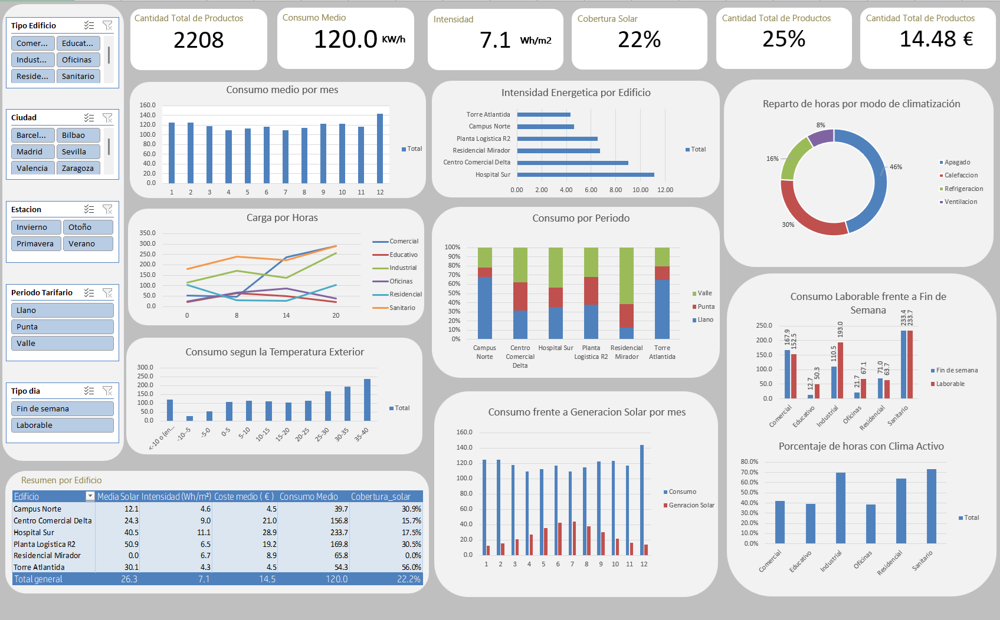

# Análisis del Consumo Energético en Edificios Instrumentados

Proyecto de análisis exploratorio de datos · Excel + Power Query

---

## Descripción del proyecto

Este proyecto parte de datos de seis edificios muy distintos entre sí —una torre de oficinas, un
campus universitario, un hospital, un centro comercial, una planta logística y un bloque
residencial, repartidos por seis ciudades españolas y monitorizados con sensores durante todo 2025.
Cada uno consume energía de una forma completamente distinta.

La pregunta es: ¿qué explica realmente el consumo de estos edificios y dónde hay margen de ahorro?
La intuición dice que es el clima. Los datos, cuando los miras con calma, dicen otra cosa.

El objetivo del proyecto es hacer un análisis exploratorio completo de estos datos y plasmarlo en un
dashboard que permita comparar edificios, detectar patrones de uso y ver de un vistazo dónde merece
la pena mirar primero.

Para llegar ahí se ha hecho, por este orden:

- **Limpieza y transformación** con Power Query (lenguaje M): quitar duplicados, normalizar
  categorías escritas de formas distintas, tratar valores fuera de rango, poner el tipo bien en las
  columnas.
- **Columnas nuevas** calculadas a partir de las originales, sobre todo la intensidad energética
  (Wh/m²), que es la que de verdad permite comparar edificios de tamaños tan distintos.
- **Análisis descriptivo**: media, mediana, dispersión, cuartiles y correlaciones entre las variables
  numéricas.
- **Tablas dinámicas** cruzando el consumo por edificio, tipo de uso, franja horaria, tipo de día,
  estación del año, tramo de temperatura y período tarifario.
- **Dashboard** con KPIs, gráficos y segmentaciones conectadas entre sí.

---

## Estructura del proyecto

```
.
├── README.md                          # Este documento
├── data/
│   └── consumo_energetico_edificios_2025.csv   # Datos originales, SIN limpiar (2.240 x 16)
├── excel/
│   └── Analisis_Energetico_2025.xlsx           # El archivo con todo el proceso: limpieza, análisis y dashboard
├── informe/
│   ├── Informe_Energetico_2025.pdf    # Informe del análisis
│   └── Informe_Energetico_2025.docx   # El mismo informe, editable
└── capturas/
    └── dashboard.png                           # Captura del dashboard terminado
```

### Qué hay dentro del Excel

Todo el proceso está en un único archivo, `excel/Analisis_Energetico_2025.xlsx`, en tres hojas:

| Hoja | Qué contiene |
|---|---|
| `Lecturas` | La tabla ya limpia (2.208 x 23), montada como tabla de Excel |
| `Dinamicas` | Las tablas dinámicas que alimentan a los gráficos |
| `Dashboard` | El panel final: KPIs, gráficos y segmentadores |

---

## Los datos

| | |
|---|---|
| Fichero original | [`data/consumo_energetico_edificios_2025.csv`](data/consumo_energetico_edificios_2025.csv) |
| Tamaño | 2.240 filas x 16 columnas (262 KB) |
| Después de limpiar | 2.208 filas x 23 columnas |
| Período que cubre | Todo 2025, un día de cada cuatro, en 4 franjas horarias (0, 8, 14 y 20 h) |

### De dónde salen los datos

Estos datos son sintéticos: los he generado yo mismo con una simulación pensada para este proyecto,
no vienen de descargar nada de ningún portal.

Eso sí, no es un simple generador de números al azar: tiene en cuenta cosas como la estacionalidad y
el ciclo diario de la temperatura en cada ciudad, la radiación solar según la época del año, y
perfiles de ocupación distintos según el tipo de edificio (una oficina no se usa igual que un
hospital o una planta logística). Por eso las relaciones que salen en el análisis —la curva en U del
consumo con la temperatura, el desfase entre generación solar y consumo— tienen sentido físico y no
son un patrón metido a mano en el resultado.

---

## Instalación y requisitos

### Para ver el análisis (lo normal)

Con Excel 2016 o posterior en Windows es suficiente; Power Query viene incluido de serie (en 2010 y
2013 hay que instalarlo aparte, pero es gratis).

1. Descarga o clona el repositorio.
2. Abre `excel/Analisis_Energetico_2025.xlsx`.
3. Si aparece el aviso de "contenido externo deshabilitado", dale a **Habilitar contenido** para que
   las tablas dinámicas y los segmentadores funcionen bien.
4. Ve a la hoja `Dashboard` y juega con los segmentadores para filtrar.

Una advertencia si vas a intentar cargar el CSV tú mismo: el fichero usa el punto como separador
decimal. Si lo importas con la configuración regional en español, Excel puede leer `71.9` como
`719`. Hay que tipar esas columnas usando *Transformar → Tipo de datos → Usando la configuración
regional… → Inglés (Estados Unidos)*.

---

## Cómo he ido haciendo el proyecto

### 1. Elegir el tema y conseguir los datos

Elegí el consumo energético en edificios porque mezcla variables numéricas (clima, consumo, coste),
categóricas (tipo de edificio, modo de climatización, tarifa) y de tiempo, así que da para trabajar
todas las técnicas del análisis exploratorio sin forzar nada.

### 2. Limpieza en Power Query

Toda la limpieza se ha hecho en Power Query, así que cada paso queda registrado en el panel de "Pasos
aplicados" y se puede repetir. Esto es lo que corregí:

| Problema | Cuántos casos | Qué hice |
|---|---|---|
| Filas duplicadas exactas | 32 | Eliminarlas (2.240 → 2.208) |
| `ciudad` escrita de formas distintas | 112 valores | Quitar espacios y unificar mayúsculas (pasó de 35 a 6 valores) |
| `modo_hvac` escrito de formas distintas | 88 valores | Igual, de 8 a 4 valores |
| `hvac_activo` con varias codificaciones | 224 valores | `Si`/`si`/`TRUE` y `No`/`no`/`FALSE` → 1 / 0 |
| Temperatura con el centinela `-999` | 22 lecturas | Convertidas a vacío (nulo) |
| Humedad relativa por encima de 100 % | 12 lecturas | Convertidas a vacío |
| Ocupación negativa | 9 lecturas | Convertidas a vacío |
| Celdas vacías | 251 celdas | Se dejan vacías, no se rellenan con nada inventado |

Dos decisiones que tomé y que creo que hay que explicar, porque no son evidentes:

La primera es que los valores imposibles se convierten en vacío, no en cero ni en la media. Una
temperatura de −999 °C es un fallo del sensor, no un dato incorrecto. Si lo hubiera sustituido por
la media, estaría metiendo un número inventado que además distorsiona las correlaciones (las acerca
artificialmente al centro). Dejándolo vacío, Excel simplemente lo ignora al calcular promedios. Al
final quedan 288 celdas vacías, que son un 0,8 % del total: no afecta a ningún cálculo importante.

La segunda es que los picos de consumo se han dejado tal cual. El máximo llega a 2.295 kWh frente a
una mediana de 95 kWh, y en un primer vistazo parece un error. Pero no lo es: son lecturas
compatibles con un equipo funcionando mal, y detectar precisamente eso es para lo que sirve un
sistema de monitorización. Por eso, en vez de borrarlos, en todo el análisis muestro siempre la
mediana junto a la media, para que quede claro cuál es el consumo típico y cuál el consumo medio
(que no es lo mismo).

Después añadí 7 columnas nuevas (`hora`, `dia_semana`, `mes`, `estacion`, `tipo_dia`, `wh_m2`,
`energia_red_kwh`) sobre la tabla ya limpia.

### 3. Dashboard

Construir las tablas dinámicas, los gráficos y los segmentadores. Seguí dos reglas al elegir los
gráficos: nunca usar doble eje vertical y usar gráficos circulares solo cuando la variable tiene 5
categorías o menos y forman un total con sentido.



### 4. Informe

El informe que está en [`informe/`](informe/) cuenta todas las conclusiones y cómo he llegado a ellas.
También incluye las conclusiones que se pueden sacar de cada gráfica.


---

## Autor

Oscar Jiménez

